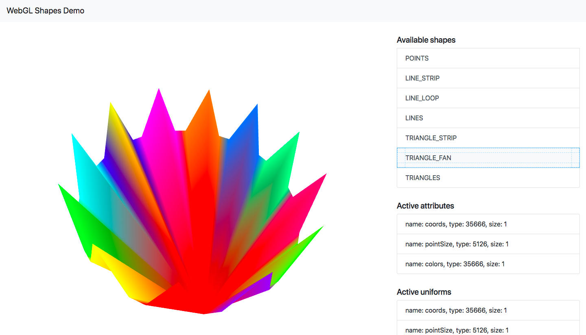

# WebGLShapes
A demonstration of different shape drawing modes of WebGL, with different translations and drawing properties set.

Written as an exercise for the Computer Graphics and Visualization Course at WUST.

